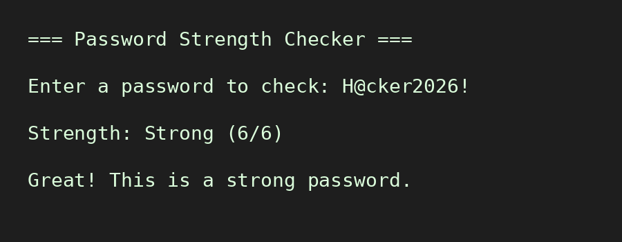

# Password Strength Checker

A simple Python command-line tool that evaluates password strength based on length, character variety (uppercase, lowercase, digits, special characters), and provides actionable suggestions for improvement.

## Features
- Scores passwords on a 0-6 scale
- Classifies strength as Weak, Moderate, or Strong
- Gives specific feedback on what to improve

## How to Run
Run the script using:

    python main.py

## Example

## Why I Built This
This is part of my ongoing learning journey in cybersecurity, focused on understanding practical password security concepts.

## License
MIT
